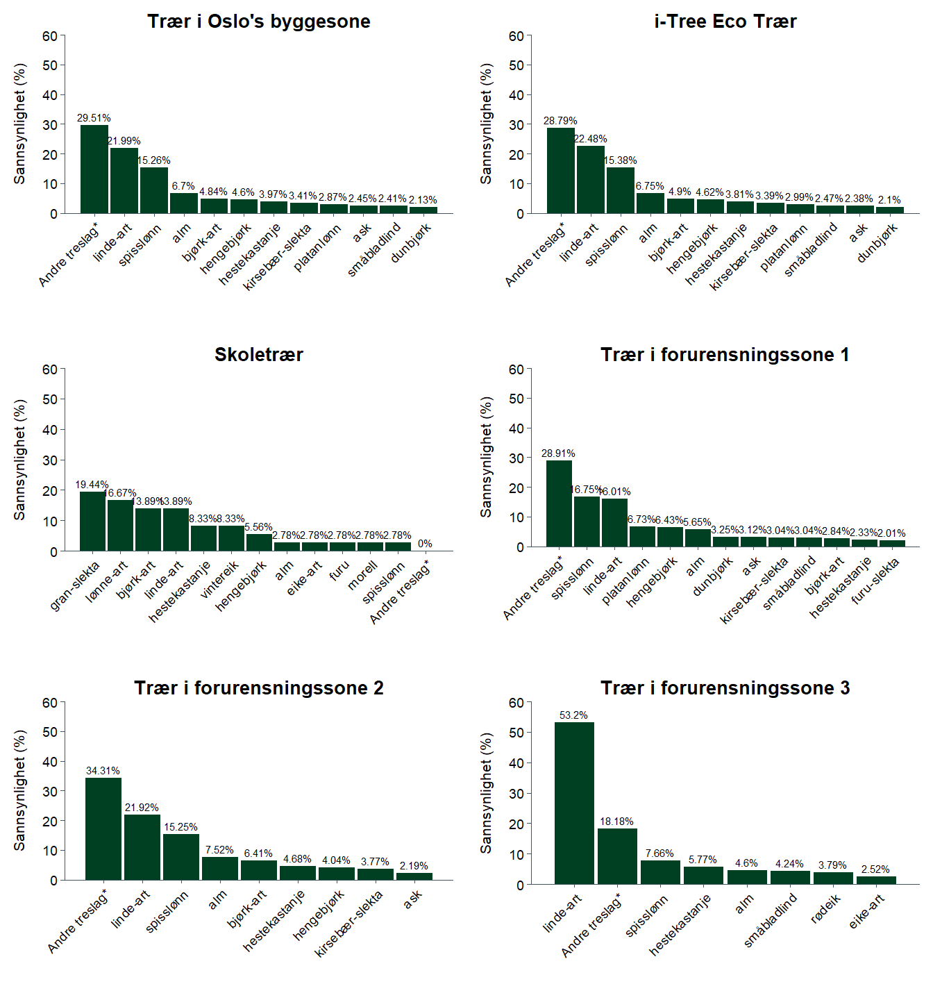
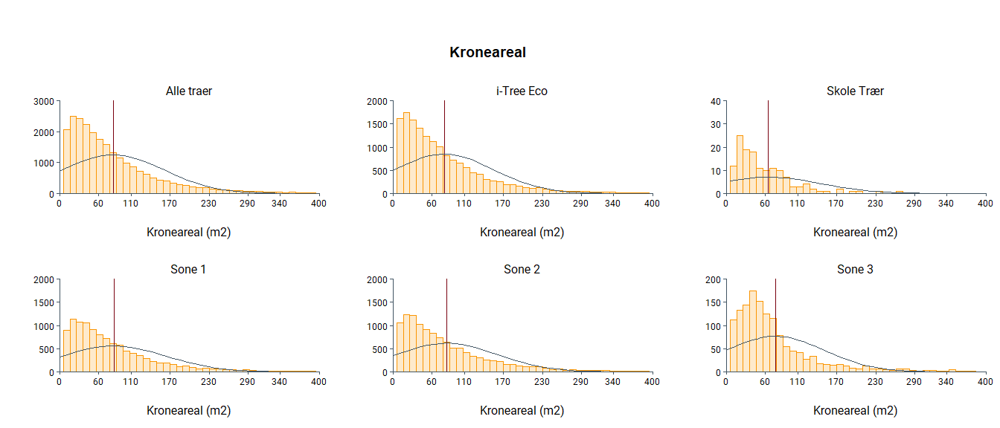
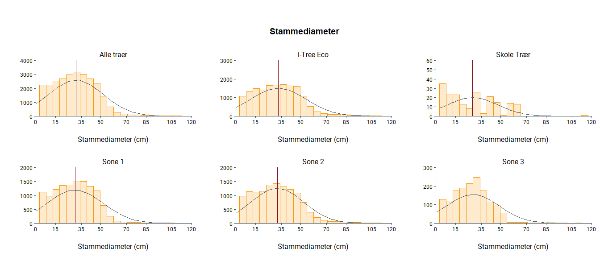

### Registrerte trær i Oslo’s byggesonen

Dette dokumentet viser sammendragstatistikken for registrerte trær
innenfor Oslo’s byggesone. Tilknyttede kartprodukter er synlige i
bytræratlaset: [Bytræratlas
Oslo](https://experience.arcgis.com/experience/%60r%20params$agol%60/)

| Gruppe                 | Beskrivelse                                          | Antall            |
|-------------------|-----------------------------------|-------------------|
| Totalt registerte trær | Totalt antall registrerte trær i Oslo                | 29928             |
| i-Tree Eco             | Totalt antall trær brukt i i-Tree Eco                | 16198             |
| Skoletrær              | Totalt antall trær plassert i undervisningsområde    | 221 (i-Tree = 27) |
| Sone 1                 | Trær i forurensnings sone 1 (grønn)                  | 14339             |
| Sone 2                 | Trær i forurensnings sone 2 (gull)                   | 13929             |
| Sone 3                 | Trær i forurensnings sone 3 (rød)                    | 1772              |
| Totalt trebestand      | Totalt antall trær i bestanden (basert på laserdata) | 633282            |

 

### Treslagsfordeling i Oslo

Treslag som har en sannsynlighet på mindre enn 2% er klassifisert som
“Andre treslag”.

\*Treslag klassifisert som ‘Andre treslag’
er: agnbøk, alm-art, amurkorktre, ask raywood, asklønn, balsampoppel,
barlind, barlind-art, bjørkekirsebær, blodbøk, blodlønn, blodlønn
crimson king, blågran, bøk, douglasgran, duetre, dvergfuru, edelgran,
edelgran-art, edelkastanje, eike-art, einer, ekte valnøtt, eple
‘alexander’, eple ‘aroma’, eple ‘beauty of bath’, eple ‘charlamovsky’,
eple ‘charles ross’, eple ‘cox’s pomona’, eple ‘fuhr’, eple
‘gravenstein’, eple ‘gul richard’, eple ‘haugmann’, eple ‘hvit
astrakan’, eple ‘ingrid marie’, eple ‘james grieve’, eple ‘july red’,
eple ‘kaniker’, eple ‘karin schneider’, eple ‘katinka’, eple ‘lobo’,
eple ‘ribston’, eple ‘rød gravenstein’, eple ‘rød ribston’, eple ‘rød
sævstaholm’, eple ‘rød torstein’, eple ‘signe tillisch’, eple
‘summerred’, eple ‘sævstaholm’, eple ‘torstein’, eple ‘transparente
blanche’, eple ‘worcester pearmain’, eple ‘åkerø’, eple-art,
fuglekirsebær, furu, furu-slekta, gran, gran-slekta, gråor, gråpoppel,
gudetre, gullpil, gullregn, gullregn-art, hagtorn, hagtorn-art, hassel,
hassel-art, hegg, hemlokk-art, hengealm, hengeblodbøk, hengebøk,
hestekastanje-art, himalayabjørk, hjertetre, hvitpil, japankirsebær,
japankisebær, japanrogn, kirsebær, kirsebærbladet hagtorn,
koloradoedelgran, koreaedelgran, krimlind, kulekirsebær, kulelønn,
kystdoglas, lerk, lerke-art, ligustersyrin, londonplatan, lundalm, lønn,
lønne-art, magnolia-art, mannaask, morell, naverlønn, neverhegg,
nordmannsedelgran, ore-art, oregoneik, ornäsbjørk, osp, papirbjørk,
parkhagtorn, parklind, plomme, plomme ‘althans’, plomme ‘herman’, plomme
‘opal’, plomme ‘reine claude d’oullins’, plomme ‘reine claude grønn’,
plomme ‘victoria’, plomme-art, poppel-slekta, prydeple, pære, pære
‘anna’, pære ‘bergamott’, pære ‘clapp’s favorite’, pære ‘clara frijs’,
pære ‘esperens herrepære’, pære ‘gråpære’, pære ‘herzogin elsa’, pære
‘ingeborg’, pære ‘moltke’, pære-art, rogn, rognasal, rogne-art, rød
hestekastanje, rødbøk, rødeik, sargentkirsebær, selje, sembrafuru,
serbergran, sibirlerk, sibirlønn, silkefuru, silkepil, sitkagran,
skarlageneik, skjørpil, smørvalnøtt, snømagnolia, sommereik, spansk
edelgran, storbladlind, storrobinia, sukkerlønn, sumpeik, surkirsebær,
svartfuru, svartor, svartsurbær, svartvalnøtt, svensk asal, syrin-art,
sølvasal, sølvedelgran, sølvlind, sølvlønn, sørgjepil, søtkirsebær,
søyleagnbøk, søylebøk, søyleeik, søyleosp, søylesvartor, tempeltre,
thuringerrogn, tokyokirsebær, tulipantre, tyrkisk hassel, tysk asal,
ungarsk syrin, urtidstre, valnøtt-art, vierslekta, vingenøtt,
vingenøtt-art, vintereik, virginiapoppel , vripil, weymouthfuru,
østamerikansk thuja 

 

### Tre egenskaper

------------------------------------------------------------------------

 

### Regulerende økosystemtjenester

------------------------------------------------------------------------

\*Treslag med gjennomsnittlig
karbonlagring \< 500 kg vises ikke i plottet. 

\*Treslag med årlig karbonbinding \< 8
kg/år vises ikke i plottet. 

\*Treslag med gjennomsnittlig reduksjon av
overflateavrenning \< 2 m3/år vises ikke i plottet. 

\*Treslag med gjennomsnittlig reduksjon av
luftforurensing \< 800 g/år vises ikke i plottet. 

 

*Dette dokumentet er en del av prosjektet:*

**TREKRONER Prosjektet** \| Trærs betydning for klimatilpasning,
karbonbinding, økosystemtjenester og biologisk mangfold.
