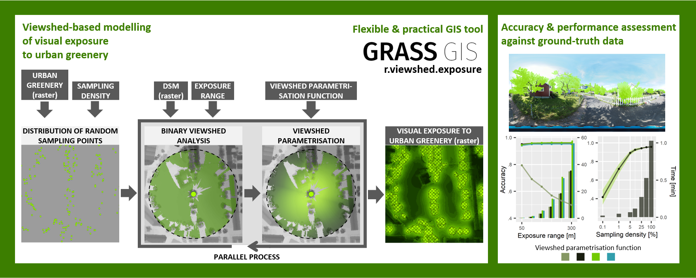
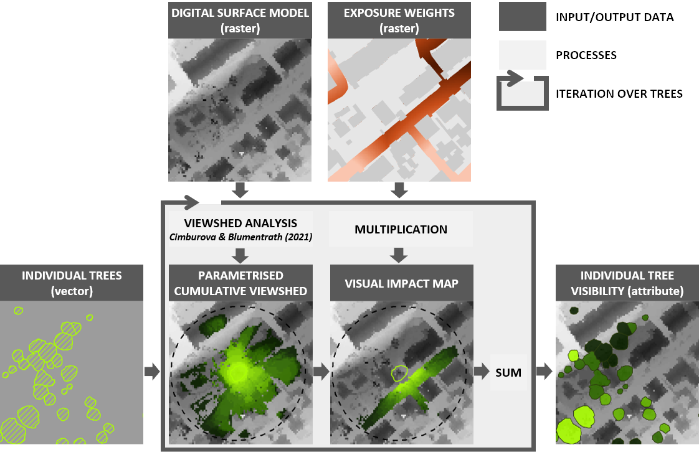

# Task 5 | Mapping of trees visibility and accessibiltiy 

This is the documentation page related to the task: **Tree Visibility** and **Impact Modelling**. 


The resulting products of the task are: 
1. a map that shows the **visual exposure** of tree crowns within the municipalities study area 
    - see layer "trekronesynlighet" in the urban tree atlases
2. a map for a case study site in Oslo, which shows the **public** and **private visibility value per tree** 
    - see figure X in NINA report
3. three indicators for the **3-30-300 rule** calculated per district (grunnkrets).
    - see figure X, X, X and X in the NINA rapport

## Installation

GRASS GIS and GRASS Addon installation instructions can be found **[HERE](installation_manual.md)**.

## Data 

The following data sources were used within this project task.

**Building footprints** 

The FKB-Buildings vector map (Kartverket, 2023a) was used to extract building footprints from the map layer ‘fkb_bygning_omrade’. In addition, we classified these footprints into residential and non-residential buildings using the bygningstype attribute (**[Table 1](tables.rst)**). 

**Water bodies**

Water bodies were derived from the land resource map FKB-AR5 (Ahlstrøm et al. 2019), category freshwater and sea (**[Table 2](tables.rst)**). .

**Digital surface model, digital terrain difference model (DSM-DTM)**

The Digital Surface Model (DSM) and Digital Terrain Model (DTM) are created from the laser point cloud data delivered by the municipalities. The DSM includes all points in the cloud, while the DTM only includes points classified as bare earth. The DSM-DTM is created by subtracting the DTM from the DSM, and it shows the height of all objects above the ground. The DSM-DTM model is down sampled to 1-meter resolution to improve processing speed.

**Tree crown polygons and binary raster**

Vector map of tree crown polygons detected from municipal laser data created in **[Task 1](../01_tree_detection/README.md)**. The crown polygons were converted into a binary raster of 1-meter resolution, where 1 represents pixels covered by tree crown and NA represent pixels without tree crown coverage. 

**Open Space**

Here open space is defined as any space within the study area which is not a building footprint, a tree canopy or a water surface as recommended by Cimburova et al. (2023). Areas smaller than 1 m² were excluded from the open space dataset. The open space dataset was classified into public and private open space using a land resource map FKB-AR5 (Ahlstrøm et al. 2019, Kartverket, 2023b) and a land use map (Statistisk sentralbyrå (SSB), 2022). The classes transport, open land, green areas, wetlands, forest and unclassified were classified as open space. Private space was classified as any open space that is not public (**[Table 3](tables.rst)**). 

**Green space**

Green space is defined by Statistics Norway (Statistisk sentralbyrå, SSB) as urban nature areas, *nærturterreng*, larger than 200 000 m2 and urban recreation areas, *leke- rekreasjon-sareal*, between 5 000 – 200 000 m2 ([SSB definition](https://www.ssb.no/natur-og-miljo/areal/statistikk/rekreasjonsareal-og-naerturterreng)). The World Health Organization (WHO) defines green space as public green spaces of at least 10 000 m2 (Konijnendijk, C. C. 2023). Here we use the definition by SSB. 

The land resource map FKB-AR5 (Ahlstrøm et al. 2019, Kartverket, 2023b) and the land use map from SSB (2022) are combined, and the different land use classes are translated to green space or no-green space. The classes forest, open land, wetland, bare rock, gravel- and stone, park, sport areas, together with lakes and ponds smaller than 1 000 m2 are classified as green space (**[Table 3](tables.rst)**). 


## Methods

### Viewshed exposure modelling

Visual exposure to urban trees was determined using the *r.viewshed.exposure* tool in GRASS GIS  developed by Cimburova and Blumentrath (2022) for all treecrown municipalities. The DSM-DTM and the tree crown binary raster served as inputs for the analysis. The default methods settings, which define a good balance between accuracy and processing time, were applied to all municipalities (**[Table 1](params.rst)**).  The viewshed parametrisation function was set to distance decay, which means that the pixel’s weight decreases the further you move away from the tree. The resulting visual exposure raster quantifies the level of visual exposure to urban trees, ranging from 0 (no exposure) to high exposure values.

```bash
# Example run of the r.viewshed.exposure tool

# Set computational region 
g.region raster=dsmdtm_1m_utm32_flt@$MAPSET -p

# Run r.viewshed.exposure tool
r.viewshed.exposure input=dsmdtm_1m_utm32_flt@oslo output=visual_exposure_1m_utm32 source=treecrown_1m_utm32_int@oslo range=100 function=Distance_decay sample_density=25 seed=1 memory=200000 nprocs=40
```

```{note}
The r.viewshed.exposure tool is a GRASS GIS addon tool. The tool is available in the GRASS GIS 8. Detailed instructions on how to install the tool can be found **[HERE](../installation_manuals/04_tree_visibility_installation.md)**.

**github-repo**: [r.viewshed.exposure](https://github.com/OSGeo/grass-addons/tree/grass8/src/raster/r.viewshed.exposure)
```


**Figure 1.** Processing workflow of the r.viewshed.exposure tool  in GRASS GIS, along with its accuracy & performance assessment. The figure is taken from Cimburova and Blumentrath (2022).


### Visual Impact Modelling

The individual tree visibility of trees located in public and private spaces were modelled using the *r.viewshed.impact* tool (Cimburova, 2023). The viewshed impact tool differs from the viewshed exposure tool as it uses an additional exposure weight layer and results in an individual tree visibility attribute value. The DSM-DTM raster was used as elevation data and the tree crown binary raster as the input source. The model was run two times, with first the public open space and second the private open space binary raster as exposure weight layer. The viewshed parametrisation function, radius and sampling density are set to the same values as for the visual exposure modelling (**[Table 2](params.rst)**). This resulted in a public tree visibility value and a private tree visibility value for each tree.

```bash
# Example run of the r.viewshed.exposure tool

# Set computational region 
g.region raster=dsmdtm_1m_utm32_flt@$MAPSET -p

# Run r.viewshed.exposure tool
r.viewshed.impact exposure=treecrowns@impact column=v_public dsm=dsmdtm_1m_utm32_flt@impact weight=public_space_1m_utm32_int@oslo_impact Range=100 seed=1 memory=200000 cores_e=10 cores_i=20
```

```{note}
The r.viewshed.exposure tool is currently under development and is not yet available as an offical GRASS GIS addon tool. However, the tool can be downloaded from GitHub, [r.viewshed.impact](https://github.com/zofie-cimburova/r.viewshed.impact), and can be installed as a local module. Detailed instructions on how to install a local module can be found **[HERE](../installation_manuals/04_tree_visibility_installation.md)**. 
```


**Figure 2.** Processing workflow of the r.viewshed.impact tool in GRASS GIS. Figure is taken from Cimburova et al. (2023).

### Calculating measures for the 3-30-300 rule

Within this study we calculated the three indicators of the 3-30-300 rule for each district (grunnkrets) within the study area.

```{note}
**The 3-30-300 green space rule** 

The 3-30-300 green space proposed by Konijnendijk (2023), is an evidence-based guideline for guideline for creating healthier and more sustainable cities through the strategic use of urban green spaces. The rule outlies three key objectives:

**Rule 3:** all residents should be able to see at least 3 trees from their home.

**Rule 30:** all neighbourhoods should have 30% tree canopy cover.

**Rule 300:**  all residents should be able to access a green area within 300 m from their home.
``````

**Rule 3: Tree visibility count for residential buildings per district** 

As an indicator for rule 3, we used a tree buffer count to estimate the number of trees visible from each residential building. The tree buffer count is calculated by counting the number of tree crowns within a specified buffer distance of each residential address (Nieuwenhuijsen et al., 2022). This study calculated the number of tree canopies that intersect with a buffer distance of 15 meters of residential buildings. The output is a new attribute assigned to each district polygon.


**Figure 3. Workflow diagram illustrating the calculation of tree crown buffer count per district.

**Rule 30: Tree crown area percentage per district (rule 30)**

The total crown area percentage is calculated per district as an indicator for rule 30, all neighbourhoods should have 30% tree canopy cover.

**Rule 300: Green area proximity for residential buildings per district (rule 300)**

We calculated the percentage of residential buildings per district that are located within a 300 m euclidean distance of green space as an indicator for rule 300. First, the *Euclidean distance* from each residential building to a green space is calculated in meters. Then, we count the number of residential houses per district that are located within 300 m of green spaces. 

### **References**
- Ahlstrøm, A., Bjørkelo, K., Fadnes, K.D. 2019. AR5 Klassifikasjonssystem. Klassifisering av arealressurser. NIBIO BOK 5 (5) 2019. <http://hdl.handle.net/11250/2596511>
- Cimburova, Z. and Blumentrath, S., 2022. Viewshed-based modelling of visual exposure to urban greenery – An efficient GIS tool for practical planning applications. Landscape and Urban Planning, Volume 222,104395. <https://doi.org/10.1016/j.landurbplan.2022.104395>
- Cimburova, Z., Blumentrath, S., Barton, D.N., 2023. Making trees visible: A GIS method and tool for modelling visibility in the valuation of urban trees. Urban Forestry & Urban Greening 81, 127839. <https://doi.org/10.1016/j.ufug.2023.127839>
- Kartverket 2023a. FKB-Bygninger. Geografisk vektordatasett. <https://kartkatalog.Geonorge.no/metadata/fkb-bygning/8b4304ea-4fb0-479c-a24d-fa225e2c6e97>
- Kartverket 2023b FKB-AR5. Geografisk vektordatasett. <https://kartkatalog.geonorge.no/metadata/fkb-ar5/166382b4-82d6-4ea9-a68e-6fd0c87bf788>
- Konijnendijk, C.C. 2023. Evidence-based guidelines for greener, healthier, more resilient neighbourhoods: Introducing the 3–30–300 rule. J. For. Res. 34, 821–830. <https://doi.org/10.1007/s11676-022-01523-z> 
- Statistisk sentralbyrå (SSB) 2022: Arealbruk 2022. Geografisk vektordatasett. <https://kartkatalog.Geonorge.no/metadata/arealbruk-2022/a965a979-c12a-4b26-90a0-f09de47dbecd>

### **Contributors**

- Willeke A'Campo (NINA), willeke.acampo@nina.no
- Zofie Cimburova, [zofie-cimburova](https://github.com/zofie-cimburova)